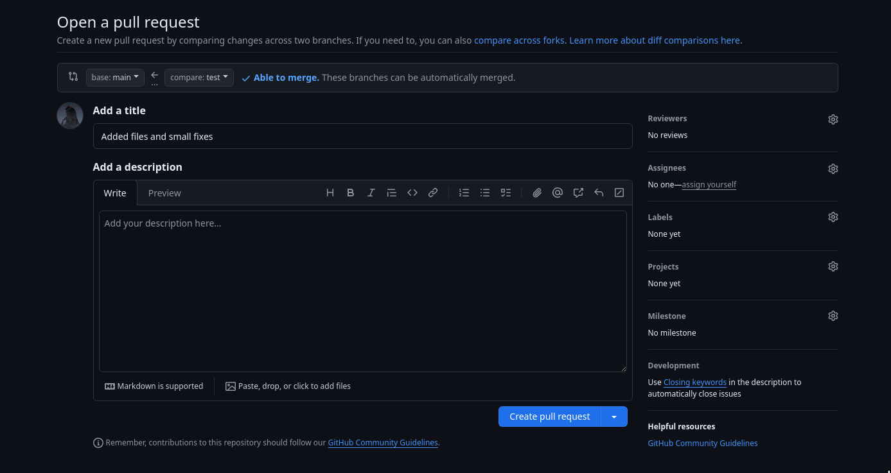

# Working with Git CLI

### Set-up Git locally with an existing remote repository
```
git init --initial-branch=main
git remote add origin *insert your git repository's ssh link here*
git pull origin main
```

### Set-up Git remotely with an existing local repository / local files
**Step 1**:

Follow the instructions on the platform for the remote repository (Github/Gitlab) on making a new repository.

**Step 2** (if git repo is not initialized):

```
git init --initial-branch=main
```

**Step 3**:

```
git remote add origin *insert your git repository's ssh link here*

```

**Step 4**:

Follow the regular workflow to push your current files to the remote repository


### Simple workflow
**Step 1**:

To add changes in the working directory to the staging area:

```
git add <filename>
```

or in case you want to stage all files in the working directory:

```
git add *
```

**Step 2**:

Checking whether the staged files are the ones desired to be committed:

```
git status
```

**Step 3**:

Commit the staged files:

```
git commit -m "your commit message"
```

**Step 4**:

Push the commited changes to the remote repository if set-up:

```
git push origin main
```
Note: main can be any branch


### Git-branches
Making a new git branch:

```
git checkout -b 'branchname'
```

Git checkout switches you to another branch, by using -b you will create a new branch.
You can now work inside this specific git branch.

Commits can be pushed to the remote repository with:

```
git push origin 'branchname'
```

### Pull requests
If you are working with a team that uses pull requests to maintain the main branch:

1. If you think the features on your branch are ready to be merged into the main branch.
2. Request a pull request via the platform your team is using (e.g. Github or Gitlab).
3. The ones reviewing the pull requests will check whether the request does not contain mistakes and is suitable to be merged into the main branch.
4. The pull request is either accepted or rejected with suggestions that should be added.

### Pull requests on Github
Each repository on Github has a 'Pull requests' tab, with a button to create new pull requests.


**Step 1**:

Pick the branch you were working on and want to create a pull request for as shown in the pictures above.





**Step 2**:

Create the pull request, add a description if you want to add some extra details to the pull request. Afterwards, make sure you assign reviewers to review your pull request and submit the pull request when you have done this.

### General workflow
If you are working with several people on the same branch, updating your local code with the newest content can be done using:

```
git pull
```

Note that this is the most simple command that can be used to do this, after all git pull is a combination of git fetch and git rebase/merge.

When working on files it is common to add them to the staging area after making some changes, this has to be done before any commits can be made. This is due to commits being based of the files in the staging area. The easiest command for this is (replace * with <file> or use a .gitignore for more precise functionality):

```
git add *
```

After implementing a certain (part of a) feature it is recommended to create a commit, which essentially snapshots the current state of the project. The usual command for this is:

```
git commit -m "your commit message"
```

It is usually recommended to shortly describe the committed changes in your commit changes, although do avoid being too verbose in your message. Commits can be pushed onto the remote repository using:

```
git push origin 'branchname'
```

Other frequently used commands are:

```
git status
git checkout 'branchname'
```

Git status shows the current status of the local repository, and git checkout 'branchname' moves your working directory to the mentioned branch.

### Merge conflicts
Git can often resolve differences between branches and merge them automatically. However, if there are conflicting changes, manual intervention will be required. This is called a merge conflict. These will frequently occur when attempting to merge a pull request. To succesfully merge a pull request, one has to resolve all the conflicts that are present. This can be done through the CLI, or through the environment on platforms such as [Github](https://docs.github.com/en/pull-requests/collaborating-with-pull-requests/addressing-merge-conflicts/resolving-a-merge-conflict-on-github).

### Extra
This document has been written by Arul, if you notice errors or unclear statements please contact me.


